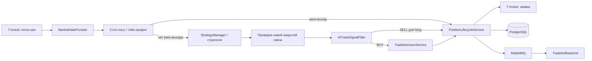

# TradeBot

Торговый бот на Kotlin / Spring Boot, который получает рыночные данные T-Invest, формирует торговые сигналы, применяет риск-менеджмент и исполняет заявки. Внешний Android-клиент не обращается к боту напрямую: публичным шлюзом выступает проект `TradebotBackend`.

## Основной поток работы



1. `TradingBotService` получает цены из gRPC-стрима T-Invest и дополняет их индикаторами.
2. Пока бот запущен, он автоматически повторяет отбор инструментов по текущим фильтрам. Открытые позиции сохраняются в наблюдаемом списке до закрытия, поэтому смена выборки не скрывает их от бота и клиента.
3. Для открытой позиции сначала безусловно проверяются стоп-лосс и тейк-профит по текущей цене.
4. Если риск-выход не сработал, активная стратегия возвращает `BUY`, `SELL` либо `HOLD`. Для свечной стратегии сигнал рассчитывается только по новой закрытой свече.
5. В long-only режиме `SELL` без открытой long-позиции игнорируется; при наличии позиции это сигнал на её закрытие, а не открытие шорта.
6. Стратегические `BUY` и `SELL` подтверждаются `AiTradeSignalFilter`, если включён `AI_ENABLED`. При выключенном AI запрос к OpenRouter не отправляется, и бот следует стратегии.
7. `TradeDecisionService` открывает только новую long-позицию, а `TradingBotService` передаёт одобренное стратегическое закрытие в `PositionLifecycleService`.
8. После исполнения покупки `PositionLifecycleService` создаёт у брокера стоп-лосс и тейк-профит; их идентификаторы сохраняются в PostgreSQL.
9. `BrokerProtectionReconciliationService` получает пользовательский поток исполнений T-Invest. Исполнение продажи запускает пакетную сверку портфеля и защитных заявок; резервная сверка выполняется раз в несколько минут только при открытых позициях.
10. `PositionLifecycleService` создаёт заявку, ждёт исполнение, сохраняет `TradeEvent` и публикует событие.

Закрытия по стоп-лоссу, тейк-профиту, ручной команде и аварийному закрытию не проходят через AI, лимиты размера позиции или фильтры стратегии. Перед самостоятельным закрытием бот отменяет обе защитные заявки и затем использует рыночную заявку с повторными попытками.

Стратегический выход в прибыли требует сильного сигнала. Стратегический выход в убытке требует двух последовательных медвежьих сигналов на двух закрытых свечах и более строгого порога AI. После любого закрытия повторный вход в тот же инструмент запрещён на настраиваемое число свечей.

## Технологии

- Kotlin 2.0, Java 17, Spring Boot 3.3;
- T-Invest Java SDK и gRPC;
- PostgreSQL + Spring Data JPA + Flyway;
- RabbitMQ для исходящих событий;
- OpenRouter API — опциональное подтверждение стратегических сигналов;
- Spring Security для внутреннего API.

## Ключевые классы

| Класс | Ответственность | Важные методы |
|---|---|---|
| `api/InternalCommandController` | Внутренний HTTP API для gateway | `start`, `stop`, `getDashboard`, `closePosition`, `closeAllPositions`, настройка стратегий, рисков и инструментов |
| `service/TradingBotService` | Оркестратор работы бота и состояние открытых позиций | `buildSignalFlow()` сначала проверяет риск-выход, затем обрабатывает стратегию один раз на закрытую свечу; `confirmLossExitOnNextCandle()` подтверждает убыточный выход; `registerReentryCooldown()` блокирует повторный вход; `emergencyStopAndCloseAllPositions()` останавливает бота и закрывает портфель |
| `strategy/StrategyManager` | Хранит и переключает активную стратегию | `getCurrentStrategy()` возвращает стратегию для очередного анализа |
| `strategy/CandlestickPatternStrategy` | Ищет паттерны только на закрытых свечах и применяет технические фильтры | `analyzePatternWithCandles()` загружает закрытые свечи, проверяет паттерн, EMA(200), RSI(14), объём и подтверждение ценой; `registerSignalExpiry()` удаляет сигнал через две свечи; `setTimeframe()` очищает кэш и активные сигналы |
| `strategy/MarketDataProvider` | Собирает цену, EMA, RSI, MACD, Bollinger Bands, ATR и объём | `fetchMarketData()` возвращает единый контекст для стратегии |
| `service/AiTradeSignalFilter` | Консервативно подтверждает `BUY`/стратегический `SELL` через OpenRouter | `evaluate()` учитывает тип сделки и минимальную уверенность AI; при сбое или невалидном ответе безопасно отклоняет стратегическую сделку |
| `service/TradeDecisionService` | Разделяет логику открытия и закрытия | `executeTrade()` открывает только long-позиции, а противоположный сигнал закрывает существующую |
| `service/PositionSizingService` | Рассчитывает объём покупки | `calculatePositionSize()` учитывает долю капитала, лимиты капитала и число позиций; `applyBrokerLimits()` приводит размер к ограничениям брокера |
| `service/PositionLifecycleService` | Исполняет и фиксирует жизненный цикл позиции | `openPosition()` подтверждает открытие и создаёт защиту у брокера; `closePositionWithRetry()` отменяет защитные заявки и закрывает рынком с повторными попытками; `closePositionsInChunks()` закрывает портфель пакетами |
| `service/PositionProtectionService` | Управляет брокерскими стоп-лоссом и тейк-профитом | `createProtection()` выставляет пару заявок после покупки; `replaceProtectionForOpenPositions()` сначала создаёт новую пару, затем отменяет старую; `cancelProtection()` снимает их перед самостоятельным закрытием |
| `service/BrokerProtectionReconciliationService` | Фиксирует исполнение брокерских SL/TP | Подписывается на пользовательский поток сделок, запускает пакетную сверку при продаже, после переподключения и по резервному таймеру; сохраняет `CLOSE` с фактическими ценой, комиссией и P&L, отменяет вторую защитную заявку |
| `service/BrokerPortfolioSyncService` | Сверяет локальное состояние с портфелем брокера | `restorePositions()` восстанавливает позиции после запуска; `synchronizeLongPositionForSell()` запрещает случайное открытие шорта |
| `service/TradeEventService` | Сохраняет историю сделок | Создаёт `OPEN`/`CLOSE` события и не допускает дублирующего закрытия одной позиции |
| `service/EventPublisherService` | Публикует доменные события в RabbitMQ | События сделок, изменения портфеля, цен, состояния бота и лимита загрузки капитала |
| `service/PortfolioSnapshotService` | Сохраняет снимки портфеля | Используется для баланса, доступных средств и расчётов риска |

## Стратегии

Все стратегии реализуют `TradingStrategy` и возвращают `Signal(direction, confidence, reason)`.

- `CrossEmaStrategy` — пересечение EMA;
- `RsiStrategy` — уровни перекупленности/перепроданности;
- `MacdStrategy` — MACD и сигнальная линия;
- `BollingerBandsStrategy` — положение цены в полосах Боллинджера;
- `CandlestickPatternStrategy` — свечные паттерны;
- `VotingStrategy` — взвешенное голосование индикаторов;
- `ConfirmationStrategy` — сигнал только при согласии нужного числа индикаторов.

### Свечная стратегия

`CandlestickPatternStrategy` поддерживает: бычье и медвежье поглощение, молот, повешенного, падающую звезду, доджи, утреннюю и вечернюю звезду, пробивающую линию, тёмное облако, три белых солдата, три чёрных ворона, марубозу и волчок.

Для входа принимаются только сигналы с динамической уверенностью не ниже `0.85`. Уверенность рассчитывается по формуле: базовая уверенность паттерна + бонус/штраф за соответствие глобальному EMA(200)-тренду + бонус за экстремальный RSI(14) + бонус/штраф за объём относительно SMA(20). Объёмный бонус выдаётся при объёме не ниже `1.5 × SMA(20)`.

Незакрытые свечи исключаются. Паттерны из трёх свечей анализируются окном `windowed(3, partialWindows = false)`. Сигнал действует две свечи после закрытия сигнальной свечи. Для `Piercing Line` и `Dark Cloud Cover` отклоняется гэп между текущим открытием и предыдущим закрытием больше `0.3%`.

## Риск-менеджмент

Настройки хранятся в таблице `risk_config` и изменяются через `/internal/command/risk/update`.

- `positionSizePercent` — доля капитала на одну новую покупку;
- `stopLossPercent`, `takeProfitPercent` — безусловные границы для открытой позиции;
- `maxCapitalUsage` — максимум капитала в открытых позициях;
- `maxPositions` — максимальное число открытых позиций;
- `brokerLimitUsage`, `minOrderCashBuffer` — защита от превышения ограничений брокера и полного расходования доступных денег.

Порядок автоматического выхода: стоп-лосс и тейк-профит имеют безусловный приоритет; затем рассматривается стратегический `SELL`. Для выхода в прибыли стратегия должна пройти порог `PROFIT_EXIT_MIN_STRATEGY_CONFIDENCE`. Для выхода в убытке нужны два последовательных сигнала и порог `LOSS_EXIT_MIN_STRATEGY_CONFIDENCE`; затем применяется более строгий AI-порог `AI_MIN_LOSS_SELL_CONFIDENCE`.

В production-режиме после каждой покупки бот создаёт у брокера две независимые защитные заявки `STOP_LOSS` и `TAKE_PROFIT`, действующие до отмены. Идентификаторы хранятся в таблице `position_protections`.

`BrokerProtectionReconciliationService` выполняет пакетную сверку при старте приложения, а при запущенном боте использует пользовательский поток сделок T-Invest как основной сигнал. При продаже и ошибке/переподключении стрима повторно выполняются один запрос за портфелем и один — за статусами stop-orders. Резервная сверка запускается только при открытых позициях с интервалом `BROKER_PROTECTION_RECONCILIATION_DELAY_MS` (по умолчанию 3 минуты). При обнаружении исполненного SL/TP бот сохраняет `CLOSE` с причиной `STOP_LOSS` или `TAKE_PROFIT`, фактическими ценой и комиссией дочерней биржевой заявки, рассчитывает P&L, убирает позицию из памяти, отменяет вторую заявку и публикует обновления клиенту.

При изменении стоп-лосса или тейк-профита через `/risk/update` бот создаёт новую пару до отмены старой. В `position_protections` сохраняются временные идентификаторы и статус замены; после рестарта незавершённая операция продолжится корректно. Если новую пару создать не удалось, прежняя защита остаётся активной, а API возвращает ошибку и новые настройки рисков не сохраняются.

Песочница T-Invest не использует `StopOrdersService`, поэтому в sandbox-режиме создание, замена и сверка этих заявок пропускаются.

## Внутренний API

Базовый путь: `/internal/command`. Контроллер защищён Basic Auth (`INTERNAL_API_USERNAME`, `INTERNAL_API_PASSWORD`) и предназначен для `TradebotBackend`.

Основные группы команд:

- `/start`, `/stop`, `/status`;
- `/strategy/*` — выбор и конфигурация стратегии;
- `/instruments`, `/instruments/rescan`, `/instruments/filters`;
- `/positions`, `/positions/{positionId}/close`, `/close-all`;
- `/dashboard`;
- `/risk`, `/risk/update`, `/risk/reset`.

### Активная стратегия

`GET /status` возвращает объект `currentStrategy`, а `GET /strategy/available` — такой же объект в поле `current`. Это единый источник фактической конфигурации активной стратегии для gateway и клиента:

```json
{
  "id": "candlestick",
  "name": "CandlestickPatterns",
  "description": "Стратегия на основе закрытых свечных паттернов",
  "type": "candlestick",
  "settings": {
    "timeframe": "M15",
    "minConfidence": 0.85
  }
}
```

Поле `id` совпадает с идентификатором из списка доступных стратегий, а `type` имеет одно из значений: `simple`, `confirmation`, `voting`, `candlestick`. Содержимое `settings` зависит от типа:

- `simple` — пустой объект;
- `confirmation` — `indicators: ["EMA", "RSI", "MACD", "BB"]`;
- `voting` — `weights: {"EMA": 3, "RSI": 2, "MACD": 2, "BB": 2}`;
- `candlestick` — `timeframe` и `minConfidence`.

`StrategyManager` формирует эти сведения из активного экземпляра стратегии: клиент не хранит их как источник истины и поэтому после перезапуска получает текущие значения бота.

## События RabbitMQ

События публикуются в `trade.events.exchange` и используются gateway для WebSocket-обновлений и push-уведомлений:

- `TRADE_EXECUTED`;
- `PORTFOLIO_CHANGED`;
- `POSITION_PRICE_UPDATED`;
- `POSITIONS_CHANGED`;
- `BOT_STATUS_CHANGED`, `BOT_HEARTBEAT`;
- `CAPITAL_USAGE_LIMIT_REACHED`.

## Конфигурация

Ключевые значения берутся из переменных окружения. Файлы `src/main/resources/dev.env` и `prod.env` локальные, исключены из Git и служат только шаблоном для среды запуска.

| Переменная | Назначение |
|---|---|
| `DB_HOST`, `DB_NAME`, `DB_USERNAME`, `DB_PASSWORD` | PostgreSQL |
| `RABBITMQ_HOST`, `RABBITMQ_PORT`, `RABBITMQ_USER`, `RABBITMQ_PASSWORD` | RabbitMQ |
| `INVEST_TOKEN` | токен T-Invest API |
| `INVEST_CONNECTOR_SANDBOX_ENABLED` | `true` для песочницы, `false` для production; в production включаются брокерские защитные заявки |
| `INTERNAL_API_USERNAME`, `INTERNAL_API_PASSWORD` | авторизация внутреннего API |
| `AI_ENABLED` | включает AI-подтверждение (`false` по умолчанию) |
| `OPENROUTER_API_KEY` | секретный ключ OpenRouter |
| `OPENROUTER_MODEL` | модель, например `openai/gpt-4o` или `openrouter/free` |
| `OPENROUTER_TIMEOUT_MS` | таймаут запроса к модели |
| `AI_MIN_BUY_CONFIDENCE` | минимальная уверенность AI для подтверждения покупки; по умолчанию `0.75` |
| `AI_MIN_PROFIT_SELL_CONFIDENCE` | минимальная уверенность AI для продажи позиции в прибыли; по умолчанию `0.70` |
| `AI_MIN_LOSS_SELL_CONFIDENCE` | минимальная уверенность AI для продажи позиции в убытке; по умолчанию `0.85` |
| `PROFIT_EXIT_MIN_STRATEGY_CONFIDENCE` | минимальная уверенность стратегии для выхода в прибыли; по умолчанию `0.80` |
| `LOSS_EXIT_MIN_STRATEGY_CONFIDENCE` | минимальная уверенность стратегии для подтверждаемого выхода в убытке; по умолчанию `0.80` |
| `REENTRY_COOLDOWN_CANDLES` | количество свечей, в течение которых повторный вход после закрытия запрещён; по умолчанию `2` |
| `BROKER_PROTECTION_RECONCILIATION_DELAY_MS` | интервал резервной пакетной сверки SL/TP при открытых позициях; по умолчанию `180000` мс (3 минуты) |
| `INSTRUMENT_RESCAN_INTERVAL_MS` | интервал автоматического пересмотра списка инструментов, пока бот запущен; по умолчанию `7200000` мс (2 часа) |

Минимальная уверенность свечной стратегии хранится в конфигурации стратегии и должна находиться в диапазоне `0.85–1.00`; значение по умолчанию — `0.85`.

Не добавляйте реальные ключи, токены и пароли в `application.properties`, README или Git.

## Запуск и проверка

```powershell
.\gradlew.bat bootRun
.\gradlew.bat test
.\gradlew.bat compileKotlin
```

Перед запуском должны быть доступны PostgreSQL, RabbitMQ и T-Invest API. Flyway применит миграции из `src/main/resources/db/migration`.
