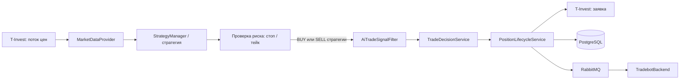

# TradeBot

Торговый бот на Kotlin / Spring Boot, который получает рыночные данные T-Invest, формирует торговые сигналы, применяет риск-менеджмент и исполняет заявки. Внешний Android-клиент не обращается к боту напрямую: публичным шлюзом выступает проект `TradebotBackend`.

## Основной поток работы



1. `TradingBotService` получает цены из gRPC-стрима T-Invest и дополняет их индикаторами.
2. Активная стратегия возвращает `BUY`, `SELL` либо `HOLD`.
3. Для открытой позиции сначала безусловно проверяются стоп-лосс и тейк-профит.
4. Обычные стратегические `BUY` и `SELL` может дополнительно подтвердить AI-фильтр. При выключенном `AI_ENABLED` запрос к OpenRouter не отправляется, и бот следует стратегии.
5. `TradeDecisionService` применяет правила открытия/закрытия, а `PositionSizingService` рассчитывает размер только для новой покупки.
6. `PositionLifecycleService` создаёт заявку, ждёт исполнение, сохраняет `TradeEvent` и публикует событие.

Закрытия по стоп-лоссу, тейк-профиту, ручной команде и аварийному закрытию не проходят через AI, лимиты размера позиции или фильтры стратегии. Они используют рыночную заявку с повторными попытками.

## Технологии

- Kotlin 2.0, Java 17, Spring Boot 3.3;
- T-Invest Java SDK и gRPC;
- PostgreSQL + Spring Data JPA + Flyway;
- RabbitMQ для исходящих событий;
- OpenRouter API — опциональное подтверждение стратегических сигналов;
- Spring Security для внутреннего API.

## Ключевые классы

| Класс | Ответственность | Важные методы |
|---|---|---|
| `api/InternalCommandController` | Внутренний HTTP API для gateway | `start`, `stop`, `getDashboard`, `closePosition`, `closeAllPositions`, настройка стратегий, рисков и инструментов |
| `service/TradingBotService` | Оркестратор работы бота и состояние открытых позиций | `start()` запускает стрим и планировщик; `buildSignalFlow()` строит путь сигнала; `emergencyStopAndCloseAllPositions()` останавливает бота и закрывает портфель; `collectPriceStreamWithReconnect()` восстанавливает поток цен при ошибке, пока есть позиции |
| `strategy/StrategyManager` | Хранит и переключает активную стратегию | `getCurrentStrategy()` возвращает стратегию для очередного анализа |
| `strategy/CandlestickPatternStrategy` | Ищет свечные паттерны на заданном таймфрейме | `analyzePatternWithCandles()` анализирует закрытые свечи; `setTimeframe()` сбрасывает кэш при смене периода |
| `strategy/MarketDataProvider` | Собирает цену, EMA, RSI, MACD, Bollinger Bands, ATR и объём | `fetchMarketData()` возвращает единый контекст для стратегии |
| `service/AiTradeSignalFilter` | Консервативно подтверждает `BUY`/стратегический `SELL` через OpenRouter | `evaluate()` возвращает `AiFilterResult`; при сбое или невалидном ответе безопасно отклоняет сделку |
| `service/TradeDecisionService` | Разделяет логику открытия и закрытия | `executeTrade()` открывает только long-позиции, а противоположный сигнал закрывает существующую |
| `service/PositionSizingService` | Рассчитывает объём покупки | `calculatePositionSize()` учитывает долю капитала, лимиты капитала и число позиций; `applyBrokerLimits()` приводит размер к ограничениям брокера |
| `service/PositionLifecycleService` | Исполняет и фиксирует жизненный цикл позиции | `openPosition()` создаёт и подтверждает открытие; `closePositionWithRetry()` закрывает рынком с повторными попытками; `closePositionsInChunks()` закрывает портфель пакетами |
| `service/BrokerPortfolioSyncService` | Сверяет локальное состояние с портфелем брокера | `restorePositions()` восстанавливает позиции после запуска; `synchronizeLongPositionForSell()` запрещает случайное открытие шорта |
| `service/TradeEventService` | Сохраняет историю сделок | Создаёт `OPEN`/`CLOSE` события и не допускает дублирующего закрытия одной позиции |
| `service/EventPublisherService` | Публикует доменные события в RabbitMQ | События сделок, изменения портфеля, цен, состояния бота и лимита загрузки капитала |
| `service/PortfolioSnapshotService` | Сохраняет снимки портфеля | Используется для баланса, доступных средств и расчётов риска |

## Стратегии

Все стратегии реализуют `TradingStrategy` и возвращают `Signal(direction, confidence, reason)`.

- `CrossEmaStrategy` — пересечение EMA;
- `RsiStrategy` — уровни перекупленности/перепроданности;
- `MacdStrategy` — MACD и сигнальная линия;
- `BollingerBandsStrategy` — положение цены в полосах Боллинджера;
- `CandlestickPatternStrategy` — свечные паттерны;
- `VotingStrategy` — взвешенное голосование индикаторов;
- `ConfirmationStrategy` — сигнал только при согласии нужного числа индикаторов.

## Риск-менеджмент

Настройки хранятся в таблице `risk_config` и изменяются через `/internal/command/risk/update`.

- `positionSizePercent` — доля капитала на одну новую покупку;
- `stopLossPercent`, `takeProfitPercent` — безусловные границы для открытой позиции;
- `maxCapitalUsage` — максимум капитала в открытых позициях;
- `maxPositions` — максимальное число открытых позиций;
- `brokerLimitUsage`, `minOrderCashBuffer` — защита от превышения ограничений брокера и полного расходования доступных денег.

## Внутренний API

Базовый путь: `/internal/command`. Контроллер защищён Basic Auth (`INTERNAL_API_USERNAME`, `INTERNAL_API_PASSWORD`) и предназначен для `TradebotBackend`.

Основные группы команд:

- `/start`, `/stop`, `/status`;
- `/strategy/*` — выбор и конфигурация стратегии;
- `/instruments`, `/instruments/rescan`, `/instruments/filters`;
- `/positions`, `/positions/{positionId}/close`, `/close-all`;
- `/dashboard`;
- `/risk`, `/risk/update`, `/risk/reset`.

## События RabbitMQ

События публикуются в `trade.events.exchange` и используются gateway для WebSocket-обновлений и push-уведомлений:

- `TRADE_EXECUTED`;
- `PORTFOLIO_CHANGED`;
- `POSITION_PRICE_UPDATED`;
- `POSITIONS_CHANGED`;
- `BOT_STATUS_CHANGED`, `BOT_HEARTBEAT`;
- `CAPITAL_USAGE_LIMIT_REACHED`.

## Конфигурация

Ключевые значения берутся из переменных окружения. Файлы `src/main/resources/dev.env` и `prod.env` локальные, исключены из Git и служат только шаблоном для среды запуска.

| Переменная | Назначение |
|---|---|
| `DB_HOST`, `DB_NAME`, `DB_USERNAME`, `DB_PASSWORD` | PostgreSQL |
| `RABBITMQ_HOST`, `RABBITMQ_PORT`, `RABBITMQ_USER`, `RABBITMQ_PASSWORD` | RabbitMQ |
| `INVEST_TOKEN` | токен T-Invest API |
| `INTERNAL_API_USERNAME`, `INTERNAL_API_PASSWORD` | авторизация внутреннего API |
| `AI_ENABLED` | включает AI-подтверждение (`false` по умолчанию) |
| `OPENROUTER_API_KEY` | секретный ключ OpenRouter |
| `OPENROUTER_MODEL` | модель, например `openai/gpt-4o` или `openrouter/free` |
| `OPENROUTER_TIMEOUT_MS` | таймаут запроса к модели |

Не добавляйте реальные ключи, токены и пароли в `application.properties`, README или Git.

## Запуск и проверка

```powershell
.\gradlew.bat bootRun
.\gradlew.bat test
.\gradlew.bat compileKotlin
```

Перед запуском должны быть доступны PostgreSQL, RabbitMQ и T-Invest API. Flyway применит миграции из `src/main/resources/db/migration`.
